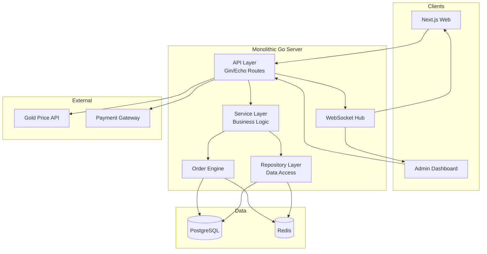

# ⚙️ Ongold - Backend API (Go)

> **Private Repository** · Source code is proprietary

---

## 📖 About The Project

High-performance backend for **Ongold** gold trading platform.

### Core Features
- 👤 **User Management** — Registration, KYC, authentication (JWT)
- 💰 **Wallet System** — Deposits, withdrawals, balance tracking
- 🥇 **Gold Trading Engine** — Spot & pending orders
- 📊 **Portfolio Management** — Auto-close on stop-loss (SL)
- 🛑 **SL/TP System** — Configurable per order
- 📈 **Multiple Lots** — Trade with adjustable lot sizes
- 👥 **Referral System** — Commission on downline trades
- 🔄 **Real-time Updates** — WebSocket for live prices & orders

---

## 🏗️ System Architecture (Monolithic)

> **Monolithic Architecture** — Single deployable unit with modular internal layers.

## 🏗️ System Architecture (Monolithic)

